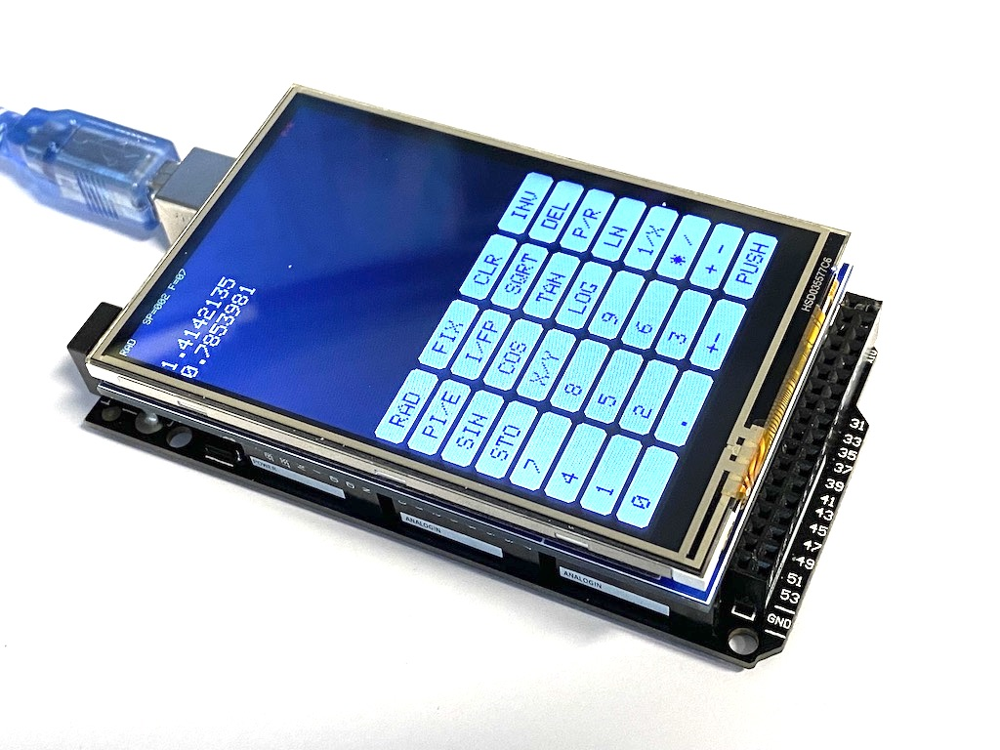

# Arduino-pocket-calculator
This directory contains the source code for a simple stack oriented pocket 
calculator based on an Arduino Mega 2650 with a 3.5 inch touch TFT display.



This is a very basic pocket calculator which uses single precision floating
point numbers to do all arithmetic. Its main purpose is to show how to 
implement simple touch screen interfaces. Neither can it compete with a real
pocket calculator nor is it intended to do so. :-) 

## Operation
Pocket calculators are a long term obsession of mine (dating back to my much
younger self, being about 7 years old, when my parents bought a pocket
calculator which deeply influenced me :-) ). This little device does not even
try to replicate any commercially available calculator (at least none I know
of).

First of all, it is a stack based calculator (RPN). To enter a number, just 
touch the digits, the sign of a number entered may be changed during number
entry by the +- key in the bottom row. In contrast to other RPN calculators
a number entered must be PUSHed explicitly onto the stack by tipping the 
PUSH "button".

Most keys have two functions with the INV key controlling which function is 
to be executed. If INV is pressed, a tiny "I" is displayed in the status 
line on top of the display. Any following key press will result in the inverse
function of that key to be executed. In the following table, TOS denotes the
value on the "top of stack" while TOS-1 represents the value in the second
element from the top of the stack:

|Key |Normal mode|INV mode|
|----|-----------|--------|
|RAD |Switch to radians mode|Switch to degrees|
|FIX |Set number of decimal places to TOS||
|CLR |Resets the calculator||
|INV |Switch to INV mode|Switch to normal mode|
|PI/E|Push pi to the stack|Push e to the stack|
|I/FP|Return the integer part of the TOS|Return the fractional part of TOS|
|SQRT|Compute the square root|Compute the square|
|DEL |Delete a number input||
|SIN |sin(TOS)|asin(TOS)|
|COS |cos(TOS)|acos(TOS)|
|TAN |tan(TOS)|atan(TOS)|
|P/R |polar -> rectangular|rectangular -> polar|
|STO |Stare TOS-1 into store location TOS|Recall from storage location TOS|
|X/Y |Swap TOS and TOS-1||
|LOG |log(TOS)|10 ** TOS|
|LN  |ln(TOS)|exp(TOS)|
|1/X |1/TOS||
|* / |TOS-1 * TOS|TOS-1 / TOS|
|+ - |TOS-1 + TOS|TOS-1 - TOS|
|PUSH|Push a number to the stack or duplicate TOS|Delete TOS|
|0..9|Enter digit||
|.   |Decimal point||
|+-  |Change sign of number being entered||

Thus, to convert the rectangular vector (1, 1) into polar form, the following
sequence of key presses is required:
```
1 PUSH PUSH INV P/R
```

## Source code
The source for this little project can be found in
[calculator.ino](calculator.ino). It should be easy to modify and adapt it
for different displays or input devices. The structure of the code is pretty
straightforward (and yes, I know that the code would not win any beauty 
contest - it is the result of about half a day of tinkering :-) ).

The program requires the libraries
```
TouchScreen
LCDWIKI_GUI
LCDWIKI_KBV
```
to be installed before compiling. These can be downloaded 
[here](http://www.lcdwiki.com/3.5inch_Arduino_Display-UNO).

The keyboard is defined in a single list of strings:
```
String keys[] = {"0", ".", "+-", "PUSH",
                 "1", "2", "3", "+ -",
                 "4", "5", "6", "* /",
                 "7", "8", "9", "1/X",
                 "STO", "X/Y", "LOG", "LN",
                 "SIN", "COS", "TAN", "P/R",
                 "PI/E", "I/FP", "SQRT", "DEL",
                 "RAD", "FIX", "CLR", "INV"
                };
```

The width and height of the keyboard is defined by KBD_X and KBD_Y. The
x/y-coordinate tupel returned from the touch screen is mapped to its 
corresponding key which is then identified by the string contained in the 
above data structure.

The actual functions are implemented in the central loop()-routine:
```
if (key_pressed == "RAD") {
    ...
}
else if (key_pressed == "FIX") {
    ...
}
...
```

Number entry is done by a simple state machine using a global state variable
to remember if a number is entered at all and if digits belong to the integer
or fraction part of the number.

A (nasty) feature of these TFT displays is that a pixel set has to be cleared
explicitly, so it is necessary to clear the areas in which the status line,
the stack contents (of which only STACK_LINES entries are shown at once), and
the number entry field whenever one of these fields is to be updated.

In the case of the status display this clear operation is done by plotting a
black box over the status line before refreshing it. The number entry routine
remembers the number and reprints it in black when it is to be erased by 
pressing DEL.

The code is pretty rudimentary and does not take care of overflows which can 
occur in divisions or tan(...) etc. It serves as a little demonstration 
program to help in dealing with such TFT touch displays.

Have fun. :-)
