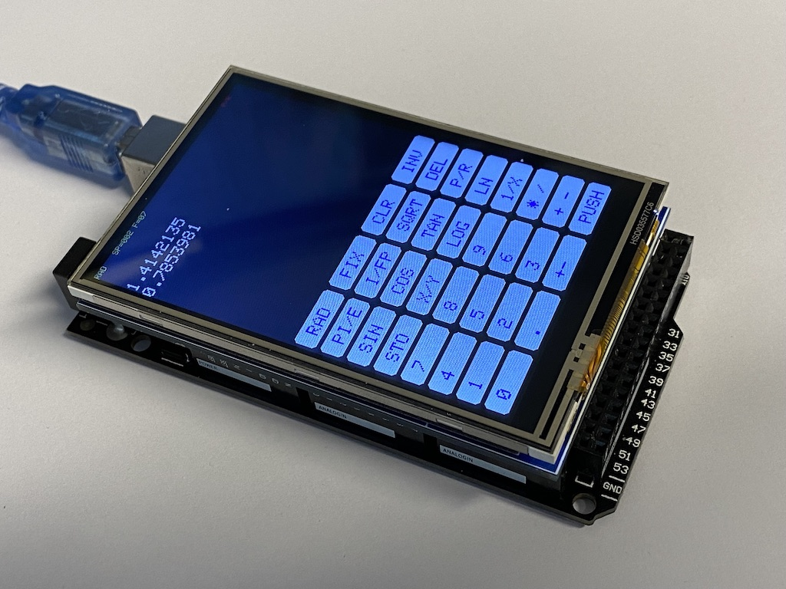

# arduino_pocket_caluclator
This directory contains the source code for a simple stack oriented pocket 
calculator based on an Arduino Mega 2650 with a 3.5 inch touch TFT display.

This is a very basic pocket calculator which uses single precision floating
point numbers to do all arithmetic. Its main purpose is to show how to 
implement simple touch screen interfaces. Neither can it compete with a real
pocket calculator nor is it intended to do so. :-) 
